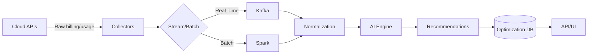

# CloudSage Architecture Overview

CloudSage’s architecture is purpose-built to deliver intelligent cost optimization while maintaining security, scalability, and cross-cloud compatibility. Here’s how we do it:

## Key Architectural Principles  
1. **Decoupled & Modular**: Components operate independently for easy updates and scaling.  
2. **Cloud-Agnostic Core**: Common logic abstracts cloud-specific differences (AWS/Azure/GCP).  
3. **Zero Raw Data Persistence**: Analyzes usage patterns without storing sensitive infrastructure metadata.  
4. **Event-Driven Scaling**: Automatic resource scaling based on analysis workload demands.  

## Core Components  

### 1. Data Collectors  
- **Cloud Connectors**:  
  - AWS: Uses Cost Explorer API and CloudWatch metrics.  
  - Azure: Leverages Cost Management and Resource Graph APIs.  
  - GCP: Integrates with BigQuery billing exports and Cloud Monitoring.  
- **Real-Time Streaming**: Processes usage data via Kafka queues for low-latency analysis.  
- **Batch Processing**: Nightly ingestion of historical billing data for trend analysis.  

### 2. Processing Pipeline  
- **Normalization Engine**: Converts vendor-specific metrics into uniform schemas.  
- **Anomaly Detection**: Flags irregular spend patterns (e.g., unattached volumes, overprovisioned instances).  
- **Usage Pattern Tagger**: Labels resources by team/environment/project using customer-defined rules.  

### 3. AI Engine  
- **Forecasting Model**: Predicts future spend via time-series analysis (Prophet framework).  
- **Recommendation Engine**: Generates savings actions using reinforcement learning tuned for cloud economics.  
- **Continuous Training**: Retrains models weekly with new billing data via Kubeflow pipelines.  

### 4. Recommendation System  
- **Savings Simulator**: Projects cost impact of optimizations (e.g., RI purchases, downscaling).  
- **Priority Scoring**: Ranks recommendations by effort-to-impact ratio.  
- **Safety Guardrails**: Blocks risky suggestions (e.g., auto-scaling below min nodes).  

### 5. API & UI Layer  
- **REST Gateway**: Securely exposes recommendations and cost dashboards.  
- **React Frontend**: Interactive visualization of spend trends and savings opportunities.  
- **Approval Workflows**: Enables team collaboration on optimization actions.  

## Data Flow  

## Security Highlights  
- **Data Protection**:  
  - Encryption in transit (TLS 1.3) and at rest (AES-256)  
  - IAM roles with least-privilege access  
- **Vendor-Specific Controls**:  
  - AWS: IAM policy condition checks  
  - Azure: Entra ID conditional access  
  - GCP: VPC Service Controls  
- **Compliance**: SOC 2 Type II, ISO 27001  

## Scalability & Reliability  
206- **Horizontal Scaling**: Kubernetes-managed microservices auto-scale to handle 100k+ resources.  
- **High Availability**: Active-active deployment across 3 AWS regions/Azure zones/GCP zones.  
- **Observability**: Prometheus/Grafana monitoring with SLO-based alerting (99.95% uptime).  
- **Cost-Efficient**: Spot instances for batch workloads, scheduled scaling for dev environments.  

👉 **Next**: Learn how to [integrate CloudSage with your cloud account](https://docs.cloudsage/integrations).