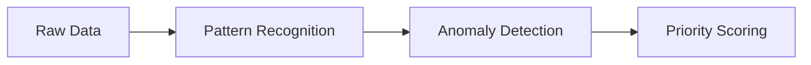

# CloudSage Resource Lifecycle

CloudSage automates cloud cost optimization through continuous analysis and proactive management of your resources. This document explains the **five-phase lifecycle** that governs how CloudSage interacts with your AWS, Azure, and GCP environments.

---

## Lifecycle Overview


Every resource managed by CloudSage follows this flow:

1. **Data Collection**  
2. **Analysis & Insights**  
3. **Recommendations**  
4. **Implementation**  
5. **Continuous Optimization**  

---

### Phase 1: Data Collection
CloudSage begins by gathering real-time infrastructure data:
- Hourly usage metrics across compute, storage, and networking
- Resource configurations and metadata
- Pricing data & commitment discounts (Reserved Instances/Savings Plans)
- Historical spending patterns (up to 365 days)

**Integration Method**  
```bash
Connects via cloud provider APIs using read-only IAM roles
```

---

### Phase 2: Analysis & Insights
Our AI engine processes collected data to identify savings opportunities:


Key analysis dimensions:
- Idle resource detection
- Overprovisioned instances
- Underutilized storage
- Commitment discount optimization
- Architectural anti-patterns

---

### Phase 3: Recommendations
CloudSage generates actionable savings plans:

| Recommendation Type | Description | Typical Savings |
|---------------------|-------------|-----------------|
| Rightsizing | CPU/Memory optimization | 15-40% |
| Scheduling | Auto-stop idle resources | 20-70% |
| Storage Tiering | Move cold data to lower tiers | 30-80% |
| Commitment Purchasing | Optimal Reserved Instance allocation | 10-45% |

**Customization Options**  
- Risk tolerance thresholds (conservative/balanced/aggressive)
- Exclusion rules for critical workloads
- Team-specific budget constraints

---

### Phase 4: Implementation
Choose your automation level:

#### Manual Mode
```markdown
1. Review recommendations in dashboard
2. Approve individual actions
3. Deploy changes via CloudSage UI
```

#### AutoPilot Mode
```
1. Define safety rules (max monthly impact, blacklist tags)
2. Enable automated execution
3. Receive change confirmation alerts
```

**Safety Features**  
- 24-hour reversal window for all changes
- Pre-deployment dry runs
- Multi-person approval workflows

---

### Phase 5: Continuous Optimization
CloudSage maintains ongoing visibility:
```python
while True:
    monitor_resource_utilization()
    compare_actual_vs_predicted()
    adjust_recommendations()
    generate_weekly_reports()
```

Key optimization activities:
- Daily cost anomaly alerts
- Weekly savings progress reports
- Quarterly architecture reviews
- Provider-specific new feature adoption tracking

---

## Next Steps
- [Configure lifecycle settings](/configuration/lifecycle-settings.md)
- [Review implementation security model](/security/access-controls.md)
- [Explore recommendation types](/features/recommendation-types.md)