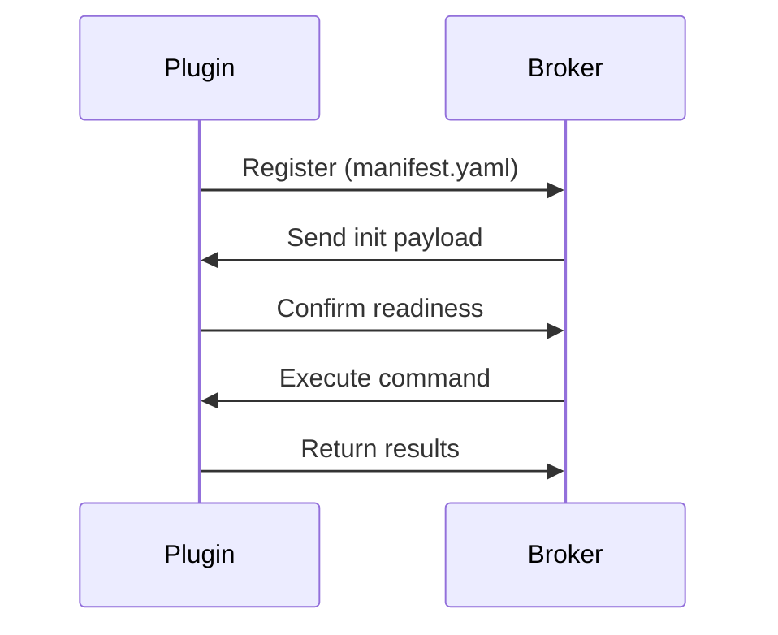

# CloudSage Plugin System

## Overview
Extend CloudSage's capabilities through our modular plugin system. Plugins let you customize cost analysis, integrate with new cloud services, add optimization strategies, and connect to third-party tools without modifying core platform code.

**Key Benefits:**
- **Extensible Architecture:** Add new providers (AWS/Azure/GCP extensions) or custom logic
- **Flexible Integration:** Create hooks for monitoring tools, CI/CD pipelines, or internal systems
- **Runtime Safety:** Execute plugins in isolated environments
- **Dynamic Loading:** Add/remove plugins without service restarts

## Core Architecture

 *See Architecture documentation for full diagram*

**Key Components:**
- **Plugin Core:** Runtime environment and dependency management
- **Adapters:** Translation layer between plugins and CloudSage core
- **Extension Points:** Pre-defined hooks for plugin integration:
  - `CostAnalysisHook`
  - `ResourceScanner`
  - `OptimizationEngine`
  - `AlertHandler`
- **Broker Service:** Manages plugin lifecycle and communication

## Supported Plugin Types

### 1. Cloud Adapters
```yaml
type: cloud-adapter
target: alibaba-cloud
```
Extend support to new cloud providers by implementing:
- Credential handling
- Service catalog mapping
- Cost API translation

### 2. Optimizers
```yaml
type: optimizer
resource-type: compute
```
Create custom optimization rules for:
- Instance right-sizing
- Storage tiering
- Reservation planning
- Idle resource detection

### 3. Notifiers
```yaml
type: notifier
channels: [slack, teams]
```
Deliver alerts through new channels:
- Chat platforms
- Incident management systems
- Custom webhooks

### 4. Custom Integrations
```yaml
type: integration
system: service-now
```
Connect CloudSage with:
- CMDB systems
- ITSM platforms
- Internal finance tools

## Plugin Lifecycle
1. **Discovery**  
   Plugins are loaded from `/plugins` directory or remote repositories

2. **Registration**  
   Plugins declare capabilities via `manifest.yaml`

3. **Initialization**  
   Dependencies are injected through defined interfaces

4. **Execution**  
   Plugins are triggered by:
   - Scheduled events
   - API calls
   - System alerts
   - Manual triggers

5. **Termination**  
   Graceful shutdown with resource cleanup



## Development Guide

### Prerequisites
- CloudSage CLI v2.3+
- Python 3.10+ or Node.js 18+
- Access to plugin SDK

### Creating Your First Plugin (Python Example)

1. **Install SDK:**
   ```bash
   pip install cloudsage-plugin-sdk
   ```

2. **Scaffold project:**
   ```bash
   csg plugin create --type=optimizer --lang=python ec2-optimizer
   ```

3. **Implement core logic:**
   ```python
   from cloudsage.optimizers import BaseOptimizer

   class EC2Optimizer(BaseOptimizer):
       def analyze(self, instances):
           return [self._check_rightsizing(i) for i in instances]

       def _check_rightsizing(self, instance):
           # Custom analysis logic here
           return OptimizationRecommendation(...)
   ```

4. **Define manifest:**
   ```yaml
   name: ec2-rightsizer
   version: 1.0.0
   entry_point: optimizer.py
   type: optimizer
   cloud: aws
   resource_types:
     - ec2
   permissions:
     - ReadInstanceMetrics
   ```

5. **Test locally:**
   ```bash
   csg plugin test --fixture=ec2-instances.json
   ```

## Plugin Registration

Register plugins via CloudSage UI or CLI:
```bash
csg plugins register /path/to/plugin --environment=staging
```

**Registration Flow:**
1. Manifest validation
2. Security scan
3. Dependency resolution
4. Runtime environment provisioning
5. Service mesh integration

## Security Model

- **Sandbox Execution:** Plugins run in isolated containers
- **Content Validation:** All manifests undergo CVE scanning
- **Permission System:**
  ```yaml
  permissions:
    - ReadCostData
    - WriteRecommendations
    - AlertManagement
  ```
- **Automatic Updates:** Critical security patches applied centrally

## Example Plugins

**Cost Anomaly Detector:**
```python
@hook('post_cost_analysis')
def detect_anomalies(context):
    if context.daily_spike > 25%:
        trigger_alert('CostSpikeDetected')
```

**Reservation Planner:**
```javascript
export class ReservationPlanner {
  calculateCoverage(resources) {
    return resources.filter(r => r.usage > 0.7)
  }
}
```

**Terraform Exporter:**
```go
func GenerateTerraform(recommendation Optimization) string {
    // Convert recommendations to HCL
}
```

---

> **Next Steps:**  
> - Explore [sample plugins on GitHub](https://github.com/cloudsage/plugin-examples)
> - Join our [Plugin Developer Community](https://discord.gg/cloudsage-plugins)
> - Read [Advanced Plugin Patterns](/documentation/advanced/plugin-patterns.md)