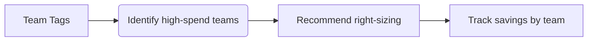

# CloudSage Advanced Features Guide

Welcome to CloudSage's advanced features! This guide walks you through powerful tools to maximize cost savings across AWS, Azure, and GCP.  

## Predictive Cost Analytics  
*CloudSage forecasts future spending using AI pattern recognition*  

- **90-Day Projections**: Get algorithmic cost predictions based on usage trends  
- **What-If Scenarios**: Model infrastructure changes (e.g., "What if I increase EC2 instances by 40%?")  

**Try it**:  
```markdown
1. Navigate to **Analytics > Forecast**  
2. Adjust sliders for different infrastructure scenarios  
3. Export CSV reports via the Download icon  
```

---

## Custom Policy Engine  
*Define rules to enforce cost governance across teams*  

**Common Policies**:  
- Block deployments exceeding $500/day without approval  
- Require cost-center tags on all resources  
- Enforce RI/SP purchase thresholds  

**Sample Policy (YAML)**:
```yaml
cost_rules:
  - name: "Prod Environment Budget"
    conditions:
      - environment: "production"
      - daily_spend > 2000
    actions:
      - notify: "#cloud-finance-slack"
      - freeze_resources: true
```

---

## Anomaly Detection System  
*Real-time AI-powered spending alerts*  

Our system detects:  
✅ Unusual storage cost spikes  
✅ Abandoned resources (e.g. unattached GPUs)  
✅ Outlier services compared to peer teams  

**Configuration**:  
1. Set alert thresholds in **Monitoring > Anomaly Settings**  
2. Choose notification channels: Email/Slack/PagerDuty  

---

## Tag-Driven Optimization  
*Maximize savings through metadata intelligence*  

CloudSage correlates tags with spending patterns:  


**Best Practices**:  
- Use consistent `project`, `environment`, and `owner` tags  
- Enable **Tag Compliance Dashboard** under Governance  

---

## Multi-Cloud Reserved Instance Advisor  
*Automated RI/SP/CUD purchasing guidance*  

Features:  
- Purchase timing recommendations  
- Optimal term length analysis (1yr vs 3yr)  
- Cross-cloud discount comparisons  

**AWS Example Workflow**:  
```markdown
1. Review RI recommendations under **Recommendations > AWS**  
2. Select instance family (e.g. m5.large)  
3. Choose upfront payment option  
4. Click **Commit Purchases** (requires IAM permissions)  
```

---

## Cross-Cloud Cost Comparison  
*Standardized cost metrics across providers*  

Compare equivalent services:  
| CloudSage Metric | AWS      | Azure      | GCP        |
|------------------|----------|------------|------------|
| Compute Unit     | vCPU-hour| vCore-hour | vCPU-hour  | 
| Storage Unit     | GB-month | GiB-month  | GB-month   | 

Access via **Reports > Cross-Cloud Comparison**  

---

## Workflow Automation  
*API-driven optimization pipelines*  

**Key Endpoints**:  
```http
POST /api/v1/recommendations/apply
Content-Type: application/json

{
  "recommendation_ids": ["rec_aws_2389","rec_azure_0842"],
  "approval_workflow": "manager"
}
```

**Terraform Integration**:  
```hcl
module "cloudsage_optimization" {
  source  = "cloudsage/optimizer/aws"
  version = ">=2.3"

  auto_apply_savings = true
  approval_threshold = 500 # USD
}
```

---

## Next Steps  
Ready to dive deeper? Explore these resources:  
- [Cost Allocation Strategies](/documentation/governance/tag-strategies.md)  
- [API Reference](/documentation/api/overview.md)  
- [Security Controls](/documentation/security/permissions.md)  

Need help? Contact our team at **support@cloudsage.ai** or via in-app chat!